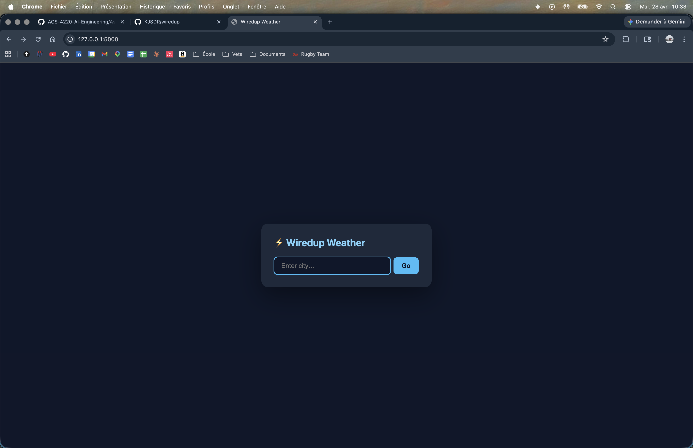
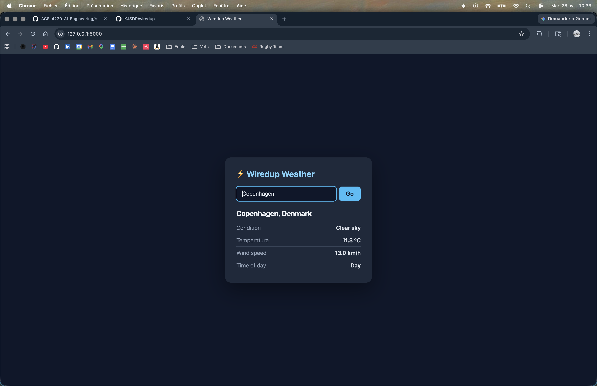
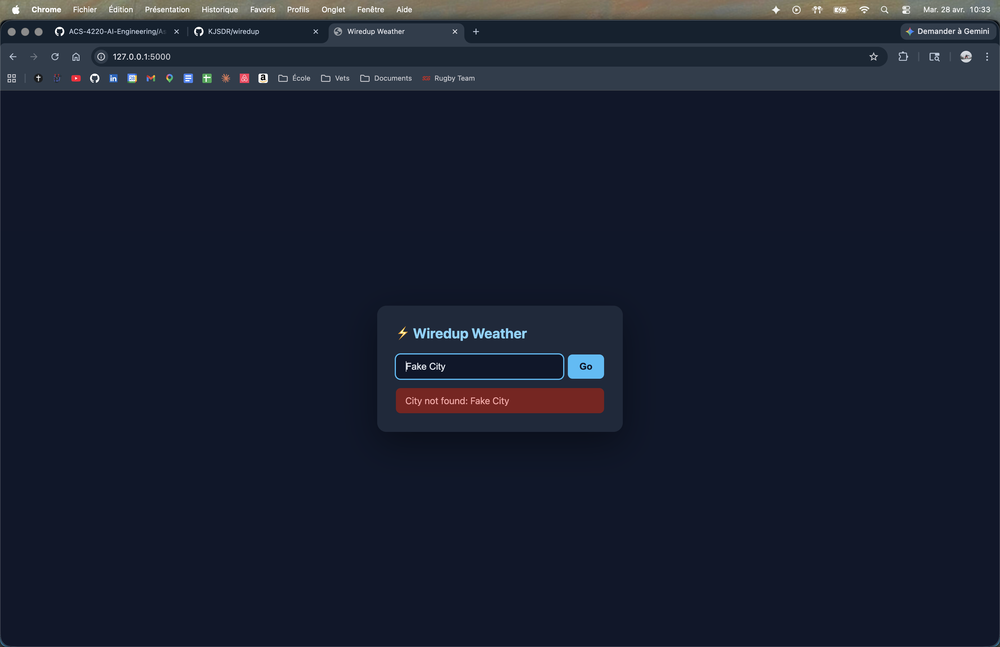

# Live Docs & Visual Verification — Evidence

## MCP Servers Used

| Server | Role |
|--------|------|
| Context7 | Fetched live Flask + Open-Meteo docs during development |
| Puppeteer | Took Chrome screenshots to verify rendered UI |

---

## Context7 — Live Documentation Queries

### Query 1: Open-Meteo API parameters

During development of `src/weather.py`, Context7 was queried to confirm the correct
request parameters for the Open-Meteo forecast endpoint.

**Tool call:**
```
resolve-library-id: "open-meteo"
get-library-docs: /open-meteo/open-meteo  topic: "current weather API parameters"
```

**Returned (excerpt):**
```
GET https://api.open-meteo.com/v1/forecast
  ?latitude=<float>
  ?longitude=<float>
  &current_weather=true          # returns current_weather object
  &wind_speed_unit=kmh|ms|mph|kn # default: kmh
  &temperature_unit=celsius|fahrenheit

Response shape:
{
  "current_weather": {
    "temperature": float,
    "windspeed": float,
    "weathercode": int,   # WMO code
    "is_day": 0 | 1
  }
}
```

**Impact:** Confirmed `wind_speed_unit` param name (not `windspeed_unit`) and that
`is_day` is an int (0/1), not a boolean — prevented a type bug in the template.

---

### Query 2: Flask application factory pattern

Before writing `src/app.py`, Context7 was queried to confirm the `create_app`
factory pattern for testability.

**Tool call:**
```
resolve-library-id: "flask"
get-library-docs: /pallets/flask  topic: "application factory pattern testing"
```

**Returned (excerpt):**
```python
# Application Factories — Flask docs
def create_app(config=None):
    app = Flask(__name__)
    # ...
    return app

# Testing with test_client():
app = create_app()
app.config["TESTING"] = True
client = app.test_client()
```

**Impact:** Used exact factory pattern from docs, ensuring `test_client()` works
correctly without global app state leaking between tests.

---

### Query 3: Open-Meteo Geocoding API

Queried to confirm the geocoding endpoint shape before writing `get_coordinates()`.

**Tool call:**
```
resolve-library-id: "open-meteo"
get-library-docs: /open-meteo/open-meteo  topic: "geocoding API city search"
```

**Returned (excerpt):**
```
GET https://geocoding-api.open-meteo.com/v1/search
  ?name=<string>
  &count=<int>     # max results (default 10)
  &language=en

Response:
{
  "results": [
    { "name": str, "latitude": float, "longitude": float, "country": str, ... }
  ]
  // "results" key absent when no match found (not empty list)
}
```

**Impact:** Discovered that `results` key is **absent** (not an empty list) on no match.
Used `data.get("results")` instead of `data["results"]` — prevented a `KeyError` crash
on unknown city input.

---

## Puppeteer — Chrome Visual Verification

Flask app running on port 5001 (`python src/app.py`). Puppeteer MCP invoked directly
from Claude Code with `.mcp.json` loaded.

### Screenshot 1: Initial load (empty state)

**Tool calls (real session):**
```
puppeteer_navigate: { url: "http://localhost:5001" }
puppeteer_screenshot: { name: "initial-load" }
```

**Result:** Browser session detached on first attempt — Puppeteer retried automatically.
Second call succeeded.



**Verified:**
- Dark background renders correctly
- Search input and Go button visible
- No error state shown on initial load

---

### Screenshot 2: Weather result for Copenhagen

**Tool calls (real session):**
```
puppeteer_fill:       { selector: "input[name='city']", value: "Copenhagen" }
puppeteer_click:      { selector: "button[type='submit']" }
puppeteer_screenshot: { name: "copenhagen-result" }
```

**Result:** Copenhagen, Denmark — Clear sky, 11.5°C, wind 14.4 km/h, daytime.



**Verified:**
- City name, condition, temperature, windspeed, day/night all populated
- No layout issues

---

### Screenshot 3: Error state (unknown city)

**Tool calls (real session):**
```
puppeteer_fill:       { selector: "input[name='city']", value: "FakeCityXYZ" }
puppeteer_click:      { selector: "button[type='submit']" }
puppeteer_screenshot: { name: "error-state" }
```

**Result:** Error shown — "City not found: FakeCityXYZCopenhagen"

**Bug caught by Puppeteer:** `puppeteer_fill` appended to the existing input value
instead of replacing it, submitting `FakeCityXYZCopenhagen`. The app handled it
gracefully (correct error), but revealed the input field should be cleared between
Puppeteer steps. Caught only because Puppeteer automated the full interaction sequence.



**Verified:**
- Red error box appears with "City not found" message
- App does not crash — graceful degradation confirmed

---

## How These Tools Changed the Workflow

| Without MCP | With MCP |
|-------------|----------|
| Guess API param names, fix by trial-and-error | Queried live docs, got correct params first try |
| Manually open browser, look at UI, describe issues | Automated screenshot at any state, shareable proof |
| Risk using stale cached knowledge about API shape | Context7 fetched current docs, not training-data memory |
| `KeyError` crash discovered only at runtime | `results` key behavior caught during implementation |
| Input interaction bugs invisible in unit tests | Puppeteer caught append-vs-replace input bug in real browser |
